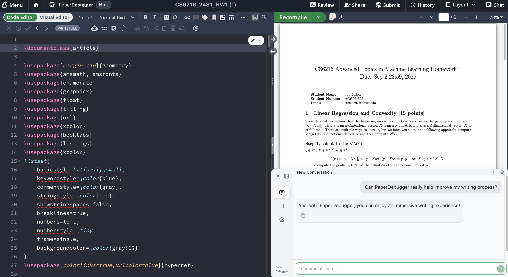
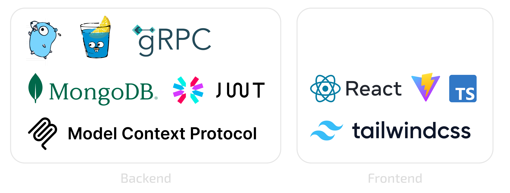

**Explore the demo paper’s supporting assets in the [/demo](/demo/) folder.**

<div align="center">
<a href="https://chromewebstore.google.com/detail/paperdebugger/dfkedikhakpapbfcnbpmfhpklndgiaog" target="_blank"></a>
<a href="https://chromewebstore.google.com/detail/paperdebugger/dfkedikhakpapbfcnbpmfhpklndgiaog" target="_blank"></a>
<a href="https://github.com/PaperDebugger/paperdebugger/releases" target="_blank"></a>
<a href="https://github.com/PaperDebugger/paperdebugger/actions/workflows/release.yml" target="_blank"></a>
<a href="https://github.com/PaperDebugger/PaperDebugger?tab=AGPL-3.0-1-ov-file"></a>
</div>

**PaperDebugger** is an AI-powered academic writing assistant that helps researchers debug and improve their LaTeX papers with intelligent suggestions and seamless Overleaf integration. It is powered by a custom MCP-based orchestration engine that simulates the full academic workflow **Research → Critique → Revision**. <br>
This enables multi-step reasoning, reviewer-style critique, and structured revision passes beyond standard chat-based assistance.

<div align="center">
    <a href="https://chromewebstore.google.com/detail/paperdebugger/dfkedikhakpapbfcnbpmfhpklndgiaog" target="_blank"><strong>🚀 Install from Chrome Web Store</strong></a> • <a href="https://github.com/PaperDebugger/paperdebugger/releases/latest" target="_blank"><strong>📦 Download Latest Release</strong></a>
</div>

<div align="center">
  
  
  
</div>

## 🌐 Social Media & Community Groups
Our team is actively working to improve long-term reliability, hoping to iron out issues this month. Thank you for your patience. <br>
Stay connected with the PaperDebugger community! Join our channels below for updates, announcements, and support.
<div align="center">
  
  
</div>


## 📋 Table of Contents

- [📋 Table of Contents](#-table-of-contents)
- [✨ Features](#-features)
- [🎯 Quick Start](#-quick-start)
  - [For Users](#for-users)
  - [Custom Endpoint Configuration](#custom-endpoint-configuration)
- [🏗️ Architecture Overview](#️-architecture-overview)
- [🛠️ Development Setup](#️-development-setup)
  - [Prerequisites](#prerequisites)
    - [System Requirements](#system-requirements)
    - [Development Tools](#development-tools)
    - [Quick Installation (macOS/Linux with Homebrew)](#quick-installation-macoslinux-with-homebrew)
  - [Backend Build](#backend-build)
    - [1. Clone the Repository](#1-clone-the-repository)
    - [2. Start MongoDB](#2-start-mongodb)
    - [3. Environment Configuration](#3-environment-configuration)
    - [4. Custom MCP Backend Orchestration](#4-custom-mcp-backend-orchestration-optional-for-local-dev)
    - [5. Build and Run](#5-build-and-run)
  - [Frontend Extension Build](#frontend-extension-build)
    - [Chrome Extension Development](#chrome-extension-development)
    - [Installing the Development Extension](#installing-the-development-extension)

## ✨ Features

PaperDebugger never modifies your project, it only reads and provides suggestions.

- **🤖 AI-Powered Chat**: Intelligent conversations about your Overleaf project
- **⚡ Instant Insert**: One-click insertion of AI responses into your project
- **💬 Comment System**: Automatically generate and insert comments into your project
- **📚 Prompt Library**: Custom prompt templates for different use cases
- **🔒 Privacy First**: Your content stays secure - we only read, never modify
- **🧠 Multi-Agent Orchestration** – [XtraMCP](https://github.com/4ndrelim/academic-paper-mcp-server) support for literature-grounded research, AI-Conference review, and domain-specific revision

https://github.com/user-attachments/assets/6c20924d-1eb6-44d5-95b0-207bd08b718b

## 🎯 Quick Start

### For Users

1. **Install the Extension**
   - [Chrome Web Store](https://chromewebstore.google.com/detail/paperdebugger/dfkedikhakpapbfcnbpmfhpklndgiaog) (Recommended)
   - [Latest Release](https://github.com/PaperDebugger/paperdebugger/releases/latest) (Manual Install)

2. **Manual Installation**
   - Download the latest release
   - Open Chrome and go to `chrome://extensions/`
   - Enable "Developer mode"
   - Click "Load unpacked" or drag the extension file

3. **Start Using**
   - Open any Overleaf project
   - Click the PaperDebugger icon
   - Begin chatting with your LaTeX assistant!

### Custom Endpoint Configuration

If you want to use a **self-hosted** PaperDebugger backend, you can configure a custom endpoint. **Note**: You need to handle HTTPS serving yourself, as Chrome blocks HTTP requests from HTTPS websites for security reasons.

**Steps:**
1. Open the PaperDebugger extension
2. Go to Settings, click the version number 5 times to enable "Developer Tools" (a.)
3. Enter your backend URL in the "Backend Endpoint" field (b.)
4. Refresh the page

If you encounter endpoint errors after refresh, use the "Advanced Options" at the bottom of the login page to reconfigure.

<div align="center">
  
</div>

## 🏗️ Architecture Overview

The PaperDebugger backend is built with modern technologies:

<div align="center">
  
</div>

- **Language**: Go 1.24+
- **Framework**: Gin (HTTP) + gRPC (API)
- **Database**: MongoDB
- **AI Integration**: OpenAI API
- **Architecture**: Microservices with Protocol Buffers
- **Authentication**: JWT-based with OAuth support


## 🛠️ Development Setup

### Prerequisites

#### System Requirements
- **Go**: 1.24 or higher
- **Node.js**: LTS version (for frontend build)
- **MongoDB**: 4.4 or higher
- **Git**: For cloning the repository

#### Development Tools
- **Buf**: Protocol Buffer compiler
- **Wire**: Dependency injection code generator
- **Make**: Build automation

#### Quick Installation (macOS/Linux with Homebrew)
```bash
# Install Go
brew install go

# Install Buf (required for Protocol Buffers)
brew install bufbuild/buf/buf

# Install Node.js
brew install node
```

### Backend Build

#### 1. Clone the Repository
```bash
git clone https://github.com/PaperDebugger/paperdebugger.git
cd paperdebugger
```

#### 2. Start MongoDB
```bash
# Using Docker (recommended)
docker run -d --name mongodb -p 27017:27017 mongo:latest
```

#### 3. Environment Configuration
```bash
cp .env.example .env
# Edit the .env file based on your configuration
```

#### 4. Custom MCP Backend Orchestration [OPTIONAL FOR LOCAL DEV]
Our enhanced orchestration backend, [**XtraMCP**](https://github.com/4ndrelim/academic-paper-mcp-server), is partially in-production but currently closed-source while under active development. If you wish to learn more about XtraMCP backend logic, refer to [/demo/xtramcp/readme.md](./demo/xtramcp/readme.md).<br>
You can still self-host PaperDebugger without it; all core features (chat, formatting, edits, comments) work normally.

Connecting to XtraMCP unlocks:
- research-mode agents,  
- structured reviewer-style critique,  
- domain-specific revisions tailored to academic writing powered by [XtraGPT](https://huggingface.co/Xtra-Computing/XtraGPT-14B) models.

We plan to **open-source XtraMCP** once the API stabilizes for community use.


#### 5. Build and Run
```bash
# Build the backend
make build

# Run the backend server
./dist/pd.exe
```

The server will start on `http://localhost:6060`.

<div align="center">
  
</div>

**NOTE**: `"ERROR [AI Client] Failed to initialize XtraMCP session"` <br> is expected if you're hosting locally without XtraMCP or an equivalent MCP orchestration backend.

### Frontend Extension Build

#### Chrome Extension Development
```bash
cd webapp/_webapp

# Install frontend dependencies
npm install

# Build for production (connects to production server)
npm run build:prd:chrome

# Package the extension
cd dist
zip -r paperdebugger-extension.zip *
```

#### Installing the Development Extension
1. Open Chrome and navigate to `chrome://extensions/`
2. Enable "Developer mode" (toggle in top-right)
3. Click "Load unpacked" and select the `webapp/_webapp/dist` directory
   - Or drag the `paperdebugger-extension.zip` file into the extensions page

## Citation
```
@misc{hou2025paperdebugger,
      title={PaperDebugger: A Plugin-Based Multi-Agent System for In-Editor Academic Writing, Review, and Editing}, 
      author={Junyi Hou and Andre Lin Huikai and Nuo Chen and Yiwei Gong and Bingsheng He},
      year={2025},
      eprint={2512.02589},
      archivePrefix={arXiv},
      primaryClass={cs.AI},
      url={https://arxiv.org/abs/2512.02589}, 
}
```
