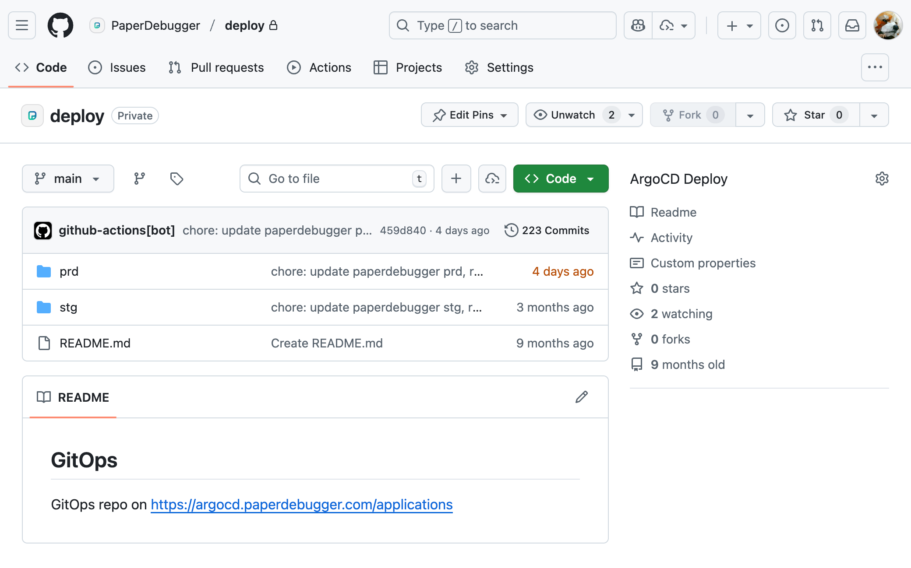

# PaperDebugger Demo Resources

- 🎬 Full Demo Video: https://drive.google.com/file/d/1g-YLlTfXdSvUA1C79lzFqlk9C8BNmuJD/view?usp=sharing

- Latest product updates: https://www.paperdebugger.com/
- Privacy overview: https://www.paperdebugger.com/privacy/
- Terms of service: https://www.paperdebugger.com/terms/
- Chrome Web Store reviews: https://chromewebstore.google.com/detail/paperdebugger/dfkedikhakpapbfcnbpmfhpklndgiaog/reviews

## Videos

Demo walkthrough clips

Explore the end-to-end PaperDebugger experience through curated clips:

https://github.com/user-attachments/assets/6c20924d-1eb6-44d5-95b0-207bd08b718b

## MCP Servers

Connect PaperDebugger to Model Context Protocol servers

### Paper Scoring

https://github.com/PaperDebugger/paperdebugger-mcp

Paper Scoring is a Multi-Agent Tool

- **Prebuilt Docker image:** https://github.com/orgs/PaperDebugger/packages/container/package/paperdebugger-mcp-server
- **Prompt template:** https://github.com/PaperDebugger/paperdebugger-mcp/tree/main/src/templates
- **Agent Flow:** https://github.com/PaperDebugger/paperdebugger-mcp/blob/main/src/agents/paper-score.ts#L23

### XtraMCP

https://github.com/4ndrelim/academic-paper-mcp-server

- **Prebuilt Docker image:** https://github.com/orgs/PaperDebugger/packages/container/package/xtragpt-mcp-server
- **Prompt template:** [./xtramcp/readme.md](./xtramcp/readme.md) (Please inspect the docker image to find the prompt templates in detail.)

## Kubernetes

Deployment patterns with ArgoCD

We rely on ArgoCD to synchronize Kubernetes manifests. Because the production deployment repository contains sensitive data, only the structure and sample files are shared here.

## Google Analytics

Usage insights and dashboards

See the companion analytics notes at [Google Analytics](./analytics/readme.md) for the full instrumentation breakdown.

